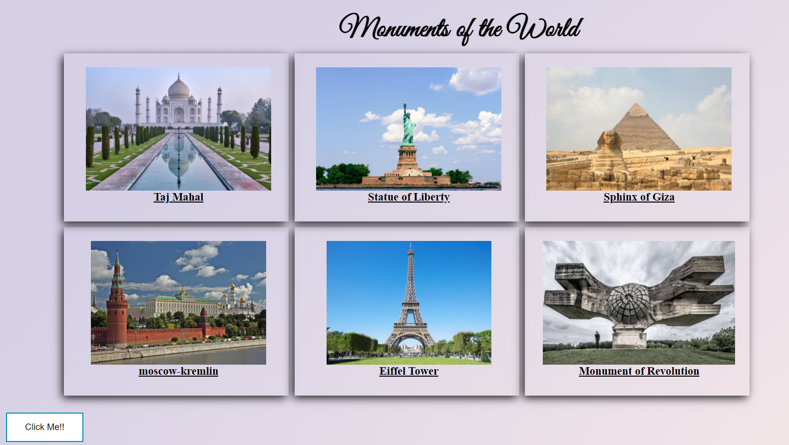
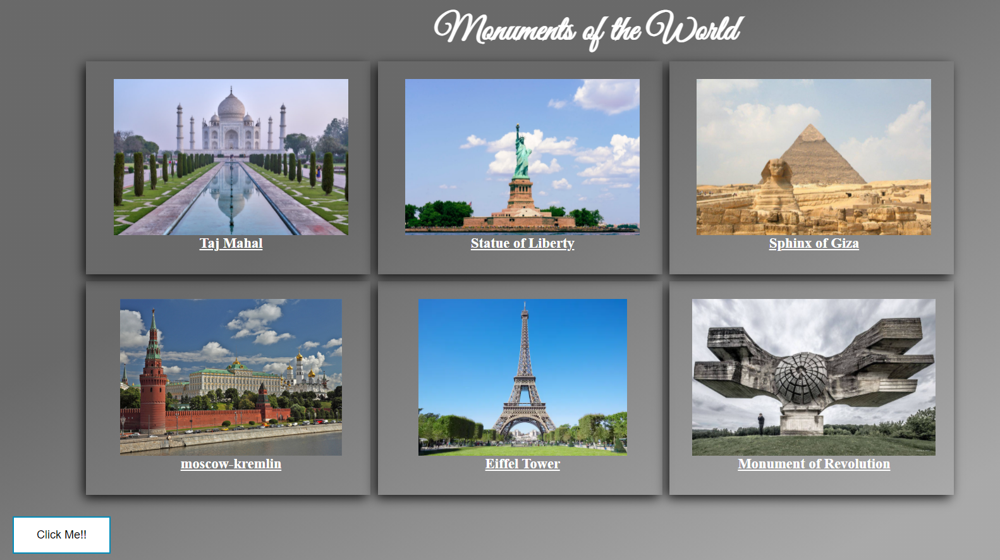
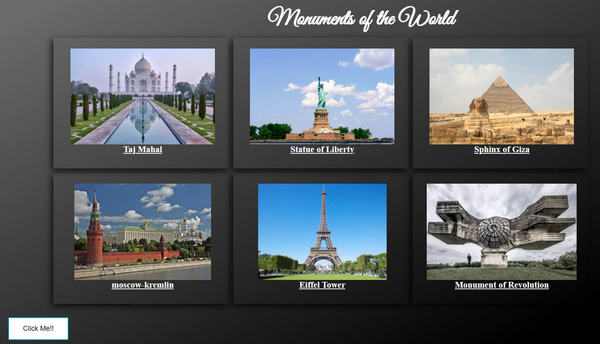

# Monuments of the World
# Description
* Developed the responsive web page using HTML and CSS that displays some of the monuments of the world. 
*  Added three modes-light mode, dim and dark mode with the help of javascript. 
* To enhance the appearance of web page, CSS shadows and gradients are used.

# Screen Captures
* Following are screen captures of the web page.

Initial View - light mode

After clicking first time - dim mode

After Clicking second time - dark mode

